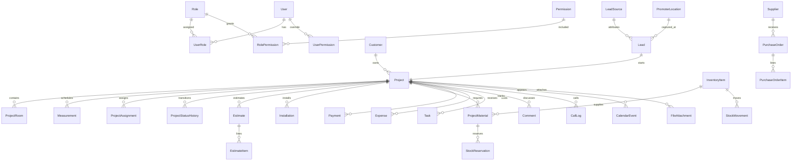

# CRM/ERP для компании по установке натяжных потолков

Статус документа: архитектурное техническое задание до начала реализации.  
Версия: 1.0.  
Цель: зафиксировать границы системы, данные, права, бизнес-инварианты и порядок разработки.

## 1. Архитектурные решения

1. **Модульный монолит на Next.js.** UI, Server Actions, Route Handlers, фоновые задания и бизнес-модули находятся в одном репозитории и разворачиваются как одно приложение. Модули общаются через публичные application-сервисы, а не обращаются к внутренним таблицам друг друга напрямую. Это сохраняет простоту транзакций и не создаёт преждевременных микросервисов.
2. **`Project` — единый рабочий агрегат от лида до закрытия.** При сохранении заявки атомарно создаются `Customer`, `Lead` и `Project` со статусом `NEW_LEAD`. `Lead` хранит происхождение и снимок данных первичного обращения, а все переходы процесса находятся только в `Project.status`. Так не возникает двух расходящихся автоматов статусов.
3. **Контактные данные не передаются через произвольные Prisma-объекты.** Телефон хранится зашифрованным на уровне приложения, поиск выполняется по HMAC-индексу, а наружу выдаются ролевые DTO: `FullPhoneDto`, `MaskedPhoneDto` или поле отсутствует полностью.
4. **RBAC плюс область данных.** Разрешение отвечает на вопрос «можно ли выполнять действие», scope/policy — «над какими строками». Например, `project.read` не даёт PROMOTER доступ ко всем проектам: policy ограничивает выборку `lead.promoterId = currentUser.id`.
5. **Склад — неизменяемый журнал движений плюс транзакционно поддерживаемые агрегаты.** Ручная запись остатка запрещена. Каждое изменение имеет движение, автора, причину и идемпотентный ключ.
6. **Деньги — `Decimal(14,2)`, количества — `Decimal(14,3)`, даты — UTC.** Валюта заказа фиксируется ISO-кодом. В интерфейсе даты показываются в часовой зоне организации; исходно `Europe/Moscow`, но зона хранится в `AppSetting`.
7. **Сметы версионируются и неизменяемы после выпуска.** Расчёт хранит входные данные, строки, снимок тарифов и версию алгоритма. Изменение тарифов не меняет старую смету.
8. **Критические записи не удаляются физически.** Проекты, движения, резервы, сметы, платежи, расходы, история статусов, назначения и аудит архивируются, аннулируются компенсирующей записью или анонимизируются по регламенту хранения.
9. **Server Actions — основной интерфейс внутренних мутаций.** Route Handlers применяются для Auth.js, файлов, webhooks, экспорта и будущих внешних интеграций. Оба пути вызывают те же application-сервисы и policy-проверки.
10. **PWA не кэширует чувствительные API-ответы.** Офлайн доступны оболочка, справочная статика и экран отсутствия сети. Телефоны, финансы, документы и рабочие карточки используют `Cache-Control: no-store`. Полноценная офлайн-синхронизация — отдельное решение после определения модели угроз.

## 2. Контекст и границы

```text
Браузер/PWA
  └─ Next.js App Router
      ├─ Server Components / Client Components
      ├─ Server Actions / Route Handlers
      ├─ Application services + policies + Zod schemas
      ├─ Domain rules (workflow, inventory, pricing, finance)
      ├─ Prisma repositories
      ├─ PostgreSQL
      ├─ S3-compatible object storage
      └─ Job runner (тот же код приложения, отдельный процесс при необходимости)
```

Внешними границами считаются S3-хранилище, почта/SMS/телефония, карты/геокодирование и, при выборе, сервис фоновых очередей или Redis. Для каждой интеграции предусматривается порт в application-слое и адаптер в infrastructure-слое.

## 3. Предлагаемая структура проекта

```text
/
├─ docs/
│  ├─ ARCHITECTURE.md
│  ├─ adr/                         # короткие Architecture Decision Records
│  └─ api/                         # контракты внешних интеграций
├─ prisma/
│  ├─ schema.prisma
│  ├─ migrations/
│  └─ seed.ts                      # системные роли, permissions, справочники
├─ public/
│  ├─ icons/
│  ├─ manifest.webmanifest
│  └─ offline.html
├─ src/
│  ├─ app/
│  │  ├─ (auth)/login/
│  │  ├─ (workspace)/
│  │  │  ├─ dashboard/
│  │  │  ├─ leads/
│  │  │  ├─ projects/
│  │  │  ├─ calendar/
│  │  │  ├─ warehouse/
│  │  │  ├─ finance/
│  │  │  ├─ analytics/
│  │  │  └─ admin/
│  │  ├─ api/
│  │  │  ├─ auth/[...nextauth]/
│  │  │  ├─ files/
│  │  │  ├─ webhooks/
│  │  │  └─ health/
│  │  ├─ error.tsx
│  │  ├─ global-error.tsx
│  │  └─ layout.tsx
│  ├─ modules/
│  │  ├─ auth/
│  │  ├─ users/
│  │  ├─ crm/
│  │  ├─ projects/
│  │  ├─ measurements/
│  │  ├─ estimates/
│  │  ├─ installations/
│  │  ├─ inventory/
│  │  ├─ procurement/
│  │  ├─ finance/
│  │  ├─ calendar/
│  │  ├─ files/
│  │  ├─ notifications/
│  │  ├─ analytics/
│  │  ├─ audit/
│  │  └─ settings/
│  │     # внутри модуля: domain/, application/, infrastructure/, ui/
│  ├─ shared/
│  │  ├─ auth/                     # requirePermission, policies, safe DTO
│  │  ├─ db/                       # Prisma client, transaction helpers
│  │  ├─ errors/                   # AppError и единый mapper
│  │  ├─ validation/               # общие Zod primitives
│  │  ├─ crypto/                   # шифрование PII, HMAC blind indexes
│  │  ├─ money/
│  │  ├─ observability/
│  │  └─ idempotency/
│  ├─ components/
│  │  ├─ ui/                       # shadcn/ui, без бизнес-логики
│  │  └─ layout/
│  ├─ jobs/                        # outbox, уведомления, скан файлов, агрегаты
│  └─ middleware.ts                # только coarse-grained routing/session checks
├─ tests/
│  ├─ unit/
│  ├─ integration/
│  ├─ policy/
│  └─ e2e/
├─ docker-compose.yml
├─ next.config.ts
├─ tailwind.config.ts
├─ vitest.config.ts
├─ playwright.config.ts
├─ eslint.config.mjs
└─ tsconfig.json                   # strict=true
```

Внутренний шаблон модуля:

```text
module/
├─ domain/          # сущности, value objects, чистые правила, state machine
├─ application/     # use cases, команды/запросы, DTO, policy gates
├─ infrastructure/  # Prisma repositories, S3/telephony adapters
└─ ui/              # формы, таблицы, view-models, локальные actions
```

Запрещён импорт `infrastructure` одного модуля из другого. Межмодульный вызов идёт через `application/public.ts`. Транзакции, охватывающие несколько модулей, координирует application use case верхнего уровня.

## 4. Модули системы

| Модуль         | Ответственность                                                                |
| -------------- | ------------------------------------------------------------------------------ |
| Auth           | вход, выход, сессии Auth.js, пароль, блокировка, rate limit, журнал входов     |
| Users & Access | пользователи, роли, permissions, пользовательские overrides, области доступа   |
| CRM            | первичный лид, клиент, источник, рекламная точка, звонки, причины отказа       |
| Projects       | карточка проекта, комнаты, статусный автомат, комментарии, назначения, история |
| Measurements   | расписание и проведение замеров, технические данные, схемы и фото              |
| Estimates      | тарифы, калькулятор, версии смет, договорная сумма                             |
| Installations  | планирование монтажа, бригада, техзадание, завершение, переделки               |
| Inventory      | номенклатура, остатки, движения, резервы, выдача, возвраты, инвентаризация     |
| Procurement    | поставщики, заказы поставщикам, ожидаемые поступления                          |
| Finance        | платежи, расходы, финансовый статус, себестоимость и прибыль                   |
| Calendar       | единое представление замеров, монтажей, звонков, доставок и задач; конфликты   |
| Files          | безопасная загрузка, карантин, MIME/sniffing, доступ по signed URL             |
| Notifications  | внутрисистемные уведомления и outbox внешних каналов                           |
| Analytics      | разрешённые агрегаты и KPI без обхода политик доступа                          |
| Audit          | append-only аудит действий и событий безопасности                              |
| Settings       | настройки организации и справочники с версионированием/архивированием          |

## 5. Модель данных

### 5.1. Общие соглашения

- Идентификаторы: UUID/`String @db.Uuid`, генерируются приложением (`uuidv7` предпочтителен для локальности индексов).
- Все изменяемые записи имеют `createdAt`, `updatedAt`; бизнес-критические — также `createdById`, `updatedById` там, где автор не следует из отдельного журнала.
- Архивируемые сущности имеют `archivedAt`, `archivedById`; PII-сущности дополнительно `deletedAt` только как признак soft delete. Прямой `DELETE` запрещён repository-слоем и правами БД.
- Оптимистическая блокировка для редактируемых карточек: `version Int`, обновление через `WHERE id = ? AND version = ?`.
- Деньги никогда не хранятся в `Float`. Проценты и коэффициенты — `Decimal`.
- Все внешние ключи обязательны, если отсутствие связи не имеет отдельного бизнес-смысла.
- Для журналов `updatedAt` отсутствует: исправление выполняется новой компенсирующей записью.
- Prisma-схема дополняется SQL-миграциями для partial indexes, CHECK constraints, generated/functional indexes и запрета UPDATE/DELETE append-only таблиц.

### 5.2. Карта связей



### 5.3. Пользователи, Auth.js и RBAC

| Сущность            | Основные поля и ограничения                                                                                                                                                                                                                                                                                                                               |
| ------------------- | --------------------------------------------------------------------------------------------------------------------------------------------------------------------------------------------------------------------------------------------------------------------------------------------------------------------------------------------------------- |
| `User`              | `id`; `email` (CITEXT, unique); `name`; `phoneEncrypted?`; `passwordHash?`; `isActive`; `blockedAt?`; `blockedReason?`; `passwordChangedAt?`; `mustChangePassword`; `failedLoginCount`; `lockedUntil?`; `lastLoginAt?`; `sessionVersion`; `createdAt`; `updatedAt`; `archivedAt?`. Пароль отсутствует для внешнего провайдера. Пользователь не удаляется. |
| `Account`           | Стандартная модель Auth.js: `userId`, `type`, `provider`, `providerAccountId`, токены и сроки; unique `(provider, providerAccountId)`; токены шифруются.                                                                                                                                                                                                  |
| `Session`           | `sessionToken` unique, `userId`, `expires`; database session позволяет немедленно отозвать доступ.                                                                                                                                                                                                                                                        |
| `VerificationToken` | `identifier`, hash токена, `expires`; unique `(identifier, tokenHash)`.                                                                                                                                                                                                                                                                                   |
| `Role`              | `id`; `code` unique (`ADMIN`, `PROMOTER`, `AD_OPERATOR`, `MEASURER`, `INSTALLER`, `WAREHOUSE_MANAGER`, `FINANCE_MANAGER`, `MANAGER`); `name`; `description?`; `isSystem`; `isActive`; timestamps. Системный код не переименовывается и не удаляется.                                                                                                      |
| `Permission`        | `id`; `code` unique в формате `resource.action[.scope]`; `description`; `sensitivity` (`NORMAL`, `PII`, `FINANCIAL`, `ADMIN`); `isSystem`; timestamps.                                                                                                                                                                                                    |
| `UserRole`          | `userId`; `roleId`; `assignedById`; `assignedAt`; `expiresAt?`; PK `(userId, roleId)`. Истёкшая роль не учитывается.                                                                                                                                                                                                                                      |
| `RolePermission`    | `roleId`; `permissionId`; `grantedById`; `createdAt`; PK `(roleId, permissionId)`.                                                                                                                                                                                                                                                                        |
| `UserPermission`    | `userId`; `permissionId`; `effect` (`ALLOW`, `DENY`); `assignedById`; `reason`; `expiresAt?`; PK `(userId, permissionId)`. Нужен для отдельного доступа FINANCE_MANAGER к телефону и read-only финансов MANAGER. `DENY` имеет высший приоритет.                                                                                                           |
| `SecurityEvent`     | `id`; `userId?`; `emailHash?`; `type` (`LOGIN_SUCCESS`, `LOGIN_FAILURE`, `LOGOUT`, `PASSWORD_RESET`, `ACCOUNT_LOCKED`, `SESSION_REVOKED`, `MFA_*`); `ipHash`; `userAgent?`; `requestId`; `metadata` (без пароля/токена/полного телефона); `occurredAt`. Append-only; indexes `(userId, occurredAt desc)`, `(emailHash, occurredAt desc)`.                 |
| `RateLimitBucket`   | `keyHash`; `action`; `windowStart`; `count`; `blockedUntil?`; updated timestamp; unique `(keyHash, action, windowStart)`. Атомарный UPSERT; можно заменить Redis без изменения auth use case.                                                                                                                                                             |

### 5.4. CRM, клиенты и проекты

| Сущность               | Основные поля и ограничения                                                                                                                                                                                                                                                                                                                                                                                                                                                                                                                                                                                                                                                                                                                                                                                                                                                      |
| ---------------------- | -------------------------------------------------------------------------------------------------------------------------------------------------------------------------------------------------------------------------------------------------------------------------------------------------------------------------------------------------------------------------------------------------------------------------------------------------------------------------------------------------------------------------------------------------------------------------------------------------------------------------------------------------------------------------------------------------------------------------------------------------------------------------------------------------------------------------------------------------------------------------------- |
| `Customer`             | `id`; `displayName`; `primaryPhoneEncrypted`; `primaryPhoneHash` (HMAC нормализованного E.164 для поиска); `secondaryPhoneEncrypted?`; `secondaryPhoneHash?`; `emailEncrypted?`; `preferredContactMethod?`; `personalDataConsentAt?`; `consentSource?`; `doNotContact`; `notesEncrypted?`; `version`; timestamps; `archivedAt?`; `deletedAt?`. Индексы по phone hash, имени (trigram при необходимости), active/archive.                                                                                                                                                                                                                                                                                                                                                                                                                                                         |
| `LeadSource`           | `id`; `code` unique; `name`; `description?`; `isActive`; `sortOrder`; timestamps; `archivedAt?`. Ссылочная запись не удаляется.                                                                                                                                                                                                                                                                                                                                                                                                                                                                                                                                                                                                                                                                                                                                                  |
| `PromoterLocation`     | `id`; `code` unique; `name`; `address`; `latitude?`; `longitude?`; `activeFrom?`; `activeTo?`; `isActive`; timestamps; `archivedAt?`.                                                                                                                                                                                                                                                                                                                                                                                                                                                                                                                                                                                                                                                                                                                                            |
| `RejectionReason`      | `id`; `code` unique; `name`; `description?`; `requiresComment`; `isActive`; `sortOrder`; timestamps; `archivedAt?`.                                                                                                                                                                                                                                                                                                                                                                                                                                                                                                                                                                                                                                                                                                                                                              |
| `Lead`                 | `id`; `publicNumber` unique; `customerId`; `projectId` unique; `sourceId`; `promoterId?`; `promoterLocationId?`; `operatorId?`; `submittedNameSnapshot`; `submittedPhoneEncrypted`; `submittedPhoneHash`; `submittedAddress?`; `initialComment?`; `consentConfirmed`; `createdVia` (`PROMOTER`, `OPERATOR`, `IMPORT`, `WEBHOOK`); `acceptedAt?`; `acceptedById?`; `version`; timestamps; `archivedAt?`. После сохранения PROMOTER не может изменять запись. Индексы `(promoterId, createdAt desc)`, `(operatorId, createdAt desc)`, `(sourceId, createdAt)`.                                                                                                                                                                                                                                                                                                                     |
| `Project`              | `id`; `internalNumber` unique; `customerId`; `leadId` unique; `contactPhoneEncrypted`; `contactPhoneHash`; `address`; `latitude? Decimal(10,7)`; `longitude? Decimal(10,7)`; `leadSourceId`; `promoterId?`; `promoterLocationId?`; `operatorId?`; `currentMeasurerId?`; `status`; `rejectionReasonId?`; `rejectionComment?`; `preferredTimeStart?`; `preferredTimeEnd?`; `measurementScheduledAt?`; `installationScheduledAt?`; `customerComment?`; `internalNoteEncrypted?`; `currency Char(3)`; `contractPrice`; `discountAmount`; `prepaymentAmount`; `paidAmount`; `balanceDue`; `costAmount`; `profitAmount`; `financialStatus`; `contractSignedAt?`; `closedAt?`; `version`; timestamps; `archivedAt?`. `balanceDue` и `profitAmount` пересчитываются сервером. Индексы `(status, createdAt)`, ответственные + status, даты замера/монтажа, source/promoter для аналитики. |
| `ProjectAssignment`    | `id`; `projectId`; `userId`; `assignmentType` (`OPERATOR`, `MEASURER`, `INSTALLER`, `WAREHOUSE`, `MANAGER`); `installationId?`; `assignedById`; `assignedAt`; `startedAt?`; `endedAt?`; `endReason?`; `isPrimary`; append-oriented. Partial unique index запрещает более одного активного primary operator/measurer, но допускает несколько монтажников. История не удаляется.                                                                                                                                                                                                                                                                                                                                                                                                                                                                                                   |
| `ProjectStatusHistory` | `id`; `projectId`; `fromStatus?`; `toStatus`; `reason?`; `rejectionReasonId?`; `actorId`; `source` (`USER`, `SYSTEM`, `IMPORT`); `metadata?`; `occurredAt`; `requestId`; `versionBefore`; `versionAfter`. Append-only; index `(projectId, occurredAt)`. Начальная запись имеет `fromStatus = null`.                                                                                                                                                                                                                                                                                                                                                                                                                                                                                                                                                                              |
| `Task`                 | `id`; `projectId?`; `title`; `description?`; `type` (`CALL`, `FOLLOW_UP`, `DELIVERY`, `MEASUREMENT`, `INSTALLATION`, `OTHER`); `status` (`OPEN`, `IN_PROGRESS`, `DONE`, `CANCELLED`); `priority`; `creatorId`; `assigneeId`; `dueAt?`; `remindAt?`; `completedAt?`; `completionNote?`; `version`; timestamps; `archivedAt?`. Индексы assignee/status/due date.                                                                                                                                                                                                                                                                                                                                                                                                                                                                                                                   |
| `Comment`              | `id`; `projectId`; `taskId?`; `authorId`; `body`; `visibility` (`GENERAL`, `INTERNAL`, `MANAGEMENT`); `editedAt?`; `redactedAt?`; timestamps. Вместо удаления — redaction с аудитом. INSTALLER не получает `INTERNAL`/`MANAGEMENT`; PROMOTER может создать только initial comment.                                                                                                                                                                                                                                                                                                                                                                                                                                                                                                                                                                                               |
| `CallLog`              | `id`; `projectId`; `operatorId`; `direction` (`INBOUND`, `OUTBOUND`); `outcome` (`ANSWERED`, `NO_ANSWER`, `BUSY`, `CALLBACK`, `REJECTED`, `OTHER`); `startedAt`; `endedAt?`; `durationSeconds?`; `providerCallId?` unique; `recordingFileId?`; `note?`; `nextCallAt?`; `createdAt`. Полный набранный номер не дублируется. Append-only, исправление — отдельное событие/аудит.                                                                                                                                                                                                                                                                                                                                                                                                                                                                                                   |

`Project.contactPhoneEncrypted` — снимок контактного номера именно по сделке, а `Customer.primaryPhoneEncrypted` — актуальный общий контакт клиента. При смене номера пользователя система явно спрашивает, обновлять ли только проект или карточку клиента; скрытой синхронизации нет.

### 5.5. Помещения и замеры

| Сущность      | Основные поля и ограничения                                                                                                                                                                                                                                                                                                                                                                                                                                                                                                                                                                                                                                                                                                                                                                                                                                                                                                                               |
| ------------- | --------------------------------------------------------------------------------------------------------------------------------------------------------------------------------------------------------------------------------------------------------------------------------------------------------------------------------------------------------------------------------------------------------------------------------------------------------------------------------------------------------------------------------------------------------------------------------------------------------------------------------------------------------------------------------------------------------------------------------------------------------------------------------------------------------------------------------------------------------------------------------------------------------------------------------------------------------- |
| `Measurement` | `id`; `projectId`; `measurerId`; `calendarEventId?`; `status` (`SCHEDULED`, `IN_PROGRESS`, `COMPLETED`, `CANCELLED`, `NO_SHOW`); `scheduledStart`; `scheduledEnd`; `actualStart?`; `actualEnd?`; `addressSnapshot`; `latitude?`; `longitude?`; `technicalSummary?`; `customerRequirements?`; `measurerComment?`; `distanceOutsideBaseKm?`; `completedAt?`; `completedById?`; `version`; timestamps; `archivedAt?`. Несколько замеров допустимы; завершённые данные не перезаписываются без аудита.                                                                                                                                                                                                                                                                                                                                                                                                                                                        |
| `ProjectRoom` | `id`; `projectId`; `measurementId?`; `name`; `sortOrder`; `dimensionMode` (`RECTANGLE`, `MANUAL`, `COMPLEX`); `length?`; `width?`; `area`; `perimeter`; `height?`; `cornerCount`; `canvasType?`; `manufacturer?`; `color?`; `texture?`; `profileType?`; `profileLength`; `insertType?`; `pipeCount`; `lightCount`; `chandelierCount`; `trackSystemCount`; `corniceCount`; `nicheCount`; `ventGrilleCount`; `fireDetectorCount`; `wardrobeBypassCount`; `additionalWorks Json` (типизированная Zod-схема: код, название, единица, количество, комментарий); `complexityCoefficient Decimal(6,3)`; `schemeFileId?`; `measurerComment?`; `version`; timestamps; `archivedAt?`. Фото связаны через `FileAttachment.roomId`. Для `RECTANGLE` площадь/периметр вычисляются сервером; для `MANUAL` обязательны введённые `area` и `perimeter`; для `COMPLEX` значения вычисляются из схемы или подтверждаются вручную. Все количества `>= 0`, коэффициент `> 0`. |

Справочники полотна, производителя, фактуры и профиля на первом этапе можно хранить как нормализованные тарифные коды в строках комнаты и snapshot сметы. Если потребуется управление ассортиментом независимо от склада, вводятся каталоги `CanvasProduct`, `ProfileProduct` с архивированием; свободный текст в выпущенной смете всё равно сохраняется снимком.

### 5.6. Монтаж и календарь

| Сущность                   | Основные поля и ограничения                                                                                                                                                                                                                                                                                                                                                                                                                                                                                                            |
| -------------------------- | -------------------------------------------------------------------------------------------------------------------------------------------------------------------------------------------------------------------------------------------------------------------------------------------------------------------------------------------------------------------------------------------------------------------------------------------------------------------------------------------------------------------------------------- |
| `Installation`             | `id`; `projectId`; `calendarEventId?`; `type` (`PRIMARY`, `REWORK`, `SERVICE`); `status` (`PLANNED`, `IN_PROGRESS`, `COMPLETED`, `CANCELLED`, `FAILED`); `scheduledStart`; `scheduledEnd`; `actualStart?`; `actualEnd?`; `technicalTask`; `technicalTaskFileId?`; `completionNote?`; `customerAcceptedAt?`; `customerAcceptedByName?`; `qualityChecklist Json?`; `reworkReason?`; `parentInstallationId?`; `completedAt?`; `version`; timestamps; `archivedAt?`. Монтажники задаются активными `ProjectAssignment` с `installationId`. |
| `CalendarEvent`            | `id`; `projectId?`; `type` (`MEASUREMENT`, `INSTALLATION`, `REWORK`, `CALL`, `DELIVERY`, `TASK`, `OTHER`); `title`; `description?`; `startsAt`; `endsAt`; `allDay`; `timezone`; `status` (`TENTATIVE`, `CONFIRMED`, `COMPLETED`, `CANCELLED`); `location?`; `createdById`; `sourceEntityType`; `sourceEntityId`; `version`; timestamps; `archivedAt?`. CHECK `endsAt > startsAt`; unique `(sourceEntityType, sourceEntityId)` там, где событие 1:1.                                                                                    |
| `CalendarEventParticipant` | `eventId`; `userId`; `participationRole`; `responseStatus`; `isRequired`; `createdAt`; PK `(eventId, userId)`. Индекс `(userId, event.startsAt)` реализуется запросом/дополнительным индексом по event.                                                                                                                                                                                                                                                                                                                                |

Пересечение определяется для всех required participants запросом диапазонов `tstzrange(startsAt, endsAt, '[)')`. PostgreSQL exclusion constraint может жёстко запретить конфликт только для подтверждённых событий; бизнес-требование говорит «без предупреждения», поэтому базовый режим: application возвращает предупреждение и требует `schedule.override_conflict`, причину и аудит. Для замерщика/монтажника без такого разрешения конфликт блокирует сохранение.

### 5.7. Склад и закупки

| Сущность            | Основные поля и ограничения                                                                                                                                                                                                                                                                                                                                                                                                                                                                                                                                                    |
| ------------------- | ------------------------------------------------------------------------------------------------------------------------------------------------------------------------------------------------------------------------------------------------------------------------------------------------------------------------------------------------------------------------------------------------------------------------------------------------------------------------------------------------------------------------------------------------------------------------------ |
| `InventoryCategory` | `id`; `parentId?`; `code` unique; `name`; `description?`; `sortOrder`; `isActive`; timestamps; `archivedAt?`. Циклы дерева запрещены.                                                                                                                                                                                                                                                                                                                                                                                                                                          |
| `InventoryLocation` | `id`; `parentId?`; `code` unique; `name`; `type` (`WAREHOUSE`, `ZONE`, `RACK`, `BIN`, `CREW`, `TRANSIT`); `address?`; `isActive`; timestamps; `archivedAt?`.                                                                                                                                                                                                                                                                                                                                                                                                                   |
| `Supplier`          | `id`; `code` unique; `name`; `taxId?`; `contactName?`; `phoneEncrypted?`; `emailEncrypted?`; `address?`; `paymentTerms?`; `isActive`; timestamps; `archivedAt?`.                                                                                                                                                                                                                                                                                                                                                                                                               |
| `InventoryItem`     | `id`; `sku` unique; `name`; `description?`; `categoryId`; `unit` (`M`, `M2`, `PCS`, `SET`, `KG`, `L` и расширяемый справочник); `defaultLocationId`; `defaultSupplierId?`; `purchasePrice`; `salePrice`; `minimumQty`; `onHandQty`; `reservedQty`; `issuedQty`; `availableQty`; `expectedQty`; `isActive`; `version`; timestamps; `archivedAt?`. Инвариант `availableQty = onHandQty - reservedQty - issuedQty`, все агрегаты `>= 0`; доступный может стать отрицательным только отдельной админской корректировкой с причиной, если политика бизнеса это разрешит.            |
| `ProjectMaterial`   | `id`; `projectId`; `roomId?`; `inventoryItemId`; `requiredQty`; `reservedQty`; `issuedQty`; `consumedQty`; `returnedQty`; `unit`; `unitCostSnapshot`; `sourceEstimateItemId?`; `status` (`PLANNED`, `PARTIALLY_RESERVED`, `RESERVED`, `ISSUED`, `CONSUMED`, `CANCELLED`); `version`; timestamps. Unique по `(projectId, roomId, inventoryItemId, sourceEstimateItemId)` с учётом nullable-полей через SQL.                                                                                                                                                                     |
| `StockReservation`  | `id`; `projectId`; `projectMaterialId`; `inventoryItemId`; `locationId`; `quantity`; `status` (`ACTIVE`, `PARTIALLY_ISSUED`, `ISSUED`, `RELEASED`, `EXPIRED`, `CANCELLED`); `reservedById`; `reservedAt`; `expiresAt?`; `releasedAt?`; `releaseReason?`; `version`. Не удаляется; unique idempotency key на команду резерва.                                                                                                                                                                                                                                                   |
| `StockMovement`     | `id`; `type` (`RECEIPT`, `RESERVATION`, `RESERVATION_RELEASE`, `ISSUE`, `RETURN`, `CONSUMPTION`, `WRITE_OFF`, `ADJUSTMENT`, `TRANSFER`); `inventoryItemId`; `quantity` (>0); `unit`; `fromLocationId?`; `toLocationId?`; `projectId?`; `projectMaterialId?`; `reservationId?`; `purchaseOrderItemId?`; `unitCost?`; `totalCost?`; `reasonCode?`; `comment?`; `performedById`; `occurredAt`; `createdAt`; `idempotencyKey` unique; `reversesMovementId?` unique; `batchCode?`; `metadata?`. Append-only. CHECK-ограничения требуют нужные локации/ссылки в зависимости от типа. |
| `PurchaseOrder`     | `id`; `number` unique; `supplierId`; `status` (`DRAFT`, `APPROVED`, `ORDERED`, `PARTIALLY_RECEIVED`, `RECEIVED`, `CANCELLED`); `currency`; `orderedAt?`; `expectedAt?`; `receivedAt?`; `totalAmount`; `createdById`; `approvedById?`; `version`; timestamps; `archivedAt?`.                                                                                                                                                                                                                                                                                                    |
| `PurchaseOrderItem` | `id`; `purchaseOrderId`; `inventoryItemId`; `orderedQty`; `receivedQty`; `unit`; `unitPrice`; `lineTotal`; `destinationLocationId`; timestamps. `lineTotal` считается сервером; `receivedQty <= orderedQty`, кроме явно разрешённой перепоставки.                                                                                                                                                                                                                                                                                                                              |

### 5.8. Сметы, тарифы и финансы

| Сущность       | Основные поля и ограничения                                                                                                                                                                                                                                                                                                                                                                                                                                                                                                                            |
| -------------- | ------------------------------------------------------------------------------------------------------------------------------------------------------------------------------------------------------------------------------------------------------------------------------------------------------------------------------------------------------------------------------------------------------------------------------------------------------------------------------------------------------------------------------------------------------ |
| `PriceBook`    | `id`; `name`; `currency`; `version`; `status` (`DRAFT`, `ACTIVE`, `RETIRED`); `validFrom`; `validTo?`; `minimumOrderAmount`; `baseZoneRadiusKm?`; `createdById`; `activatedById?`; timestamps. Только одна активная версия на момент/валюту. Активная версия неизменяема.                                                                                                                                                                                                                                                                              |
| `Tariff`       | `id`; `priceBookId`; `code`; `name`; `category` (`CANVAS_AREA`, `PERIMETER`, `PROFILE`, `CORNER`, `PIPE`, `LIGHT`, `CHANDELIER`, `CORNICE`, `NICHE`, `TRACK`, `ADDITIONAL_WORK`, `TRAVEL`); `unit`; `saleRate`; `costRate`; `conditions Json?` (производитель, фактура, профиль, диапазон количества/расстояния); `sortOrder`; `isActive`; unique `(priceBookId, code)`.                                                                                                                                                                               |
| `Estimate`     | `id`; `projectId`; `number`; `version`; `status` (`DRAFT`, `PREPARED`, `SENT`, `ACCEPTED`, `SUPERSEDED`, `CANCELLED`); `priceBookId`; `algorithmVersion`; `inputSnapshot Json`; `tariffSnapshot Json`; `subtotal`; `discountType?`; `discountValue`; `discountAmount`; `travelAmount`; `minimumOrderAdjustment`; `totalAmount`; `estimatedCost`; `estimatedProfit`; `currency`; `preparedById`; `preparedAt?`; `acceptedAt?`; `supersedesEstimateId?`; timestamps. Unique `(projectId, version)`. Выпущенные состояния (`PREPARED+`) не редактируются. |
| `EstimateItem` | `id`; `estimateId`; `projectRoomId?`; `inventoryItemId?`; `tariffCode`; `category`; `descriptionSnapshot`; `quantity`; `unit`; `unitSaleRate`; `unitCostRate`; `saleAmount`; `costAmount`; `calculationDetails Json`; `sortOrder`; timestamps. Все ставки — снимки.                                                                                                                                                                                                                                                                                    |
| `Payment`      | `id`; `projectId`; `direction` (`IN`, `REFUND`); `status` (`PENDING`, `POSTED`, `FAILED`, `CANCELLED`); `method` (`CASH`, `CARD`, `BANK_TRANSFER`, `OTHER`); `amount`; `currency`; `paidAt`; `postedAt?`; `externalReference?`; `receiptNumber?`; `comment?`; `createdById`; `approvedById?`; `idempotencyKey` unique; `reversesPaymentId?` unique; timestamps. POSTED не редактируется/не удаляется, возврат — отдельная запись.                                                                                                                      |
| `Expense`      | `id`; `projectId?`; `supplierId?`; `purchaseOrderId?`; `category` (`MATERIAL`, `LABOR`, `DELIVERY`, `TRAVEL`, `REWORK`, `OTHER`); `status` (`DRAFT`, `APPROVED`, `POSTED`, `CANCELLED`); `amount`; `currency`; `incurredAt`; `description`; `documentFileId?`; `createdById`; `approvedById?`; `idempotencyKey?` unique; `reversesExpenseId?` unique; timestamps; `archivedAt?`. POSTED исправляется реверсом.                                                                                                                                         |

`Project.paidAmount`, `balanceDue`, `costAmount`, `profitAmount` — кэшированные агрегаты для списка и аналитики. Их единственный источник: POSTED payments/expenses, фактические складские consumption/write-off и утверждённая договорная сумма. После финансовой транзакции агрегаты пересчитываются в той же транзакции; периодическая сверка выявляет расхождения.

### 5.9. Файлы, уведомления, аудит и настройки

| Сущность         | Основные поля и ограничения                                                                                                                                                                                                                                                                                                                                                                                                                                                                                                                                                                                                                                                          |
| ---------------- | ------------------------------------------------------------------------------------------------------------------------------------------------------------------------------------------------------------------------------------------------------------------------------------------------------------------------------------------------------------------------------------------------------------------------------------------------------------------------------------------------------------------------------------------------------------------------------------------------------------------------------------------------------------------------------------ |
| `FileAttachment` | `id`; ровно один родитель из `projectId?`, `roomId?`, `measurementId?`, `installationId?`, `estimateId?`, `paymentId?`, `expenseId?`, `purchaseOrderId?`, `callLogId?`; `kind` (`PHOTO`, `ROOM_SCHEME`, `TECHNICAL_TASK`, `CONTRACT`, `RECEIPT`, `RECORDING`, `OTHER`); `storageKey` unique и случайный; `originalName`; `declaredMimeType`; `detectedMimeType?`; `sizeBytes`; `sha256`; `status` (`PENDING`, `QUARANTINED`, `READY`, `REJECTED`, `ARCHIVED`); `visibility` (`PROJECT_TEAM`, `MANAGEMENT`, `FINANCE`, `PRIVATE`); `uploadedById`; `uploadedAt`; `scannedAt?`; `rejectionReason?`; `archivedAt?`. SQL CHECK обеспечивает одного родителя. Объектный bucket приватный. |
| `Notification`   | `id`; `userId`; `type`; `title`; `body`; `payload Json` (без секретов/полного телефона); `channel` (`IN_APP`, `EMAIL`, `SMS`, `PUSH`); `status` (`PENDING`, `SENT`, `FAILED`, `CANCELLED`); `readAt?`; `sentAt?`; `attemptCount`; `nextAttemptAt?`; `deduplicationKey?` unique; timestamps; `expiresAt?`.                                                                                                                                                                                                                                                                                                                                                                            |
| `OutboxEvent`    | `id`; `topic`; `aggregateType`; `aggregateId`; `payload`; `occurredAt`; `publishedAt?`; `attemptCount`; `nextAttemptAt?`; `lastErrorCode?`. Создаётся в одной транзакции с бизнес-изменением, чтобы уведомления не терялись.                                                                                                                                                                                                                                                                                                                                                                                                                                                         |
| `AuditLog`       | `id`; `actorId?`; `impersonatorId?`; `action`; `entityType`; `entityId`; `projectId?`; `beforeData?`; `afterData?`; `changedFields`; `reason?`; `requestId`; `ipHash?`; `userAgent?`; `occurredAt`; `severity`. Секреты, пароли, токены, signed URL и полный телефон не записываются; PII заменяется маской/хэшем. Append-only, помесячное партиционирование при росте.                                                                                                                                                                                                                                                                                                              |
| `AppSetting`     | `id`; `key`; `scope` (`GLOBAL`, `ORGANIZATION`); `value Json`; `schemaVersion`; `isSecret`; `version`; `updatedById`; timestamps; unique `(scope, key)`. Секретные значения лучше хранить во внешнем secret manager, а здесь — ссылку/несекретную конфигурацию.                                                                                                                                                                                                                                                                                                                                                                                                                      |

### 5.10. Ссылочная целостность и стратегия удаления

| Тип данных                                                                       | Стратегия                                                                                                                            |
| -------------------------------------------------------------------------------- | ------------------------------------------------------------------------------------------------------------------------------------ |
| Пользователи, роли, справочники                                                  | блокировка/архивирование; FK `RESTRICT`; исторические ссылки сохраняются                                                             |
| Customer, Lead, Project, Room                                                    | soft delete/архив; физическая очистка только отдельной процедурой анонимизации после срока хранения и юридического согласования      |
| StatusHistory, Assignment, StockMovement, Payment, Expense, Audit, SecurityEvent | append-only; `DELETE/UPDATE` запрещены правами БД; отмена компенсирующей записью                                                     |
| Черновики задач/смет/заказов                                                     | архивирование; `CASCADE` допускается только для никогда не опубликованного, изолированного черновика и должно быть явно подтверждено |
| Файлы                                                                            | сначала `ARCHIVED`, затем lifecycle policy удаляет объект после retention; метаданные и аудит остаются                               |
| Связи к критическим данным                                                       | `onDelete: Restrict`; `SetNull` допустим только для необязательного текущего указателя, когда история остаётся                       |

Ключевые CHECK constraints: неотрицательные деньги/количества; `endsAt > startsAt`; скидка не превышает разрешённую политикой; при `REJECTED` есть причина; координаты в допустимом диапазоне; ровно один родитель файла; допустимые локации по типу движения; совпадение валют связанных финансовых записей; текущие агрегаты проекта и склада соответствуют формулам.
